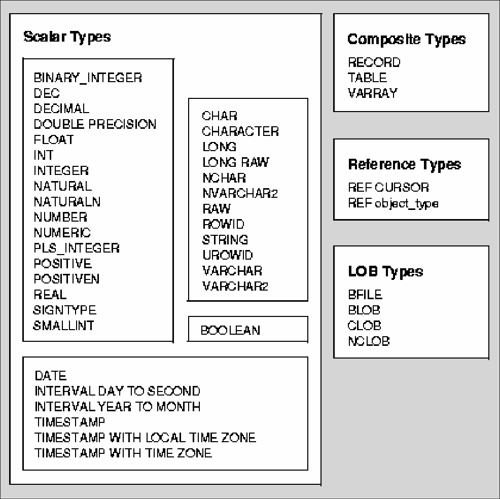

# PL/SQL Ausarbeitung - Michael Stenz
[Slides](https://stenz123.github.io/insy-plsql-referat/)
[Github/Source](https://github.com/stennz123/insy-plsql-referat)
## Allgemein
PL/SQL = Procedural Language extensions to SQL
PL/SQL ist eine Erweiterung von SQL, die prozedurale Programmierung in Oracle-Datenbanken ermöglicht. Ermöglicht implimentieren von Business logic, ausführen von Zeit und Aktionsgesteuerten Code auf Datenbankebene.
## Architektur

PL/SQL läuft auf der PL/SQL-Engine und führt SQL-Anweisungen sowie prozeduralen Code aus. Die Datenbank kümmert sich um SQL-Abfragen, während PL/SQL logische Operationen verarbeitet. Die PL/SQL Engine schickt anweisungen an den DB Server über SQL.
![[plsql-enviroment.gif]]

### PL/SQL-Block:
- DECLARE: Deklarationen (Variablen, Datentypen, Subprogramme)
- BEGIN: Ausführbarer Code
- EXCEPTION: Fehlerbehandlung
- END: Blockende

## Datentypen
PL/SQL Datentypen + SQL Datentypen.
PL/SQL Datentypen können nicht in SQL verwendet werden.
**ACHTUNG**: Boolean ist ein PL/SQL Datentyp, aber kein SQL Datentyp.
- Scalare Typen (können subtypen haben)
- Composite Typen (Records, Tabellen)
- Referenz Typen (Cursor, Objekt, Collection)

- **%TYPE**: Datentyp einer Spalte oder Variable
- **%ROWTYPE**: Datentyp, einer ganzen Zeile einer Tabelle



### RECORD
Eine Sammlung verschiedener Variablen untercshiedlicher Typen.
Deklaration mit %ROWTYPE oder explizit.

### Subtypes
Es können custom subsets von Datentypen erstellt werden, diese heißen SUBTYPES.
z.B
```sql
DECLARE
    SUBTYPE percentage_t IS PLS_INTEGER RANGE 0..100;
	SUBTYPE salery_t IS NUMBER(6, 2);
    v_percentage percentage_t := 50;
BEGIN
...
END;
```

## Loops
### Loop
Endlos loop. 
Mit `exit;` oder `exit when <statement>;` abbrechbar.

### FOR-Schleife
Loop mit Iterator. Iterator wird automatisch definiert, und kann nur innerhalb des loops verwendet werden. Kann nicht manuel verändert werden.
```sql
FOR i IN 1..10 LOOP
DBMS_OUTPUT.PUT_LINE(i);
END LOOP;
```
### WHILE-Schleife
Wiederholt sich solange eine Bedingung wahr ist.
```sql
WHILE <BEDINGUNG> LOOP
END LOOP;
```

## Funktionen, Prozeduren, Trigger und Packages
Aufrufgesteuert
    Procedure -> Kein Rückgabewert
    Function -> Rückgabewert
Aktionsgesteuert
    Trigger -> durch DML, DDL oder DB operations "getriggergt"
Zeitgesteuert
     Jobs -> Zeitgesteuerte Aufgaben

### Parameter
- IN (Standard)-> Wert übergeben (call by value)
- OUT -> gibt werte aus Prozedur/Funktion zurück (call by reference)
- IN OUT -> Mischung aus beiden. Übergibt wert und gibt zurück (call by reference)

### Prozeduren
- Kein return Wert
- `CALL`, `EXEC` oder anonymen Block aufrufbar (ACHTUNG: EXEC funktioniert nur in SQL/\*Plus oder SQL Developer)
```sql
CREATE PROCEDURE update_salary (emp_id IN NUMBER, new_salary IN NUMBER) IS
BEGIN
	UPDATE employees SET salary = new_salary WHERE id = emp_id;
END;
```

### Funktionen
- Return Wert
- Mit `SELECT` und PL/SQL aufrufbar
- Darf **keine** DML-Statements beinhalten
```sql
CREATE FUNCTION get_salary (emp_id IN NUMBER) RETURN NUMBER IS
	salary NUMBER;
BEGIN
	SELECT salary INTO salary FROM employees WHERE id = emp_id;
	RETURN salary;
END;
```

### Trigger
- Automatisch ausgelöste Aktionen bei DML, DDL oder DB-Operationen.
- BEFORE | AFTER operation
- :OLD, :NEW variablen für alten/neuen wert.
```sql
CREATE TRIGGER prevent_salary_update
BEFORE UPDATE OR INSERT ON emp
FOR EACH ROW
BEGIN
	IF :NEW.salary < :OLD.salary THEN
		RAISE_APPLICATION_ERROR(-20001, 'Gehaltskürzung nicht erlaubt');
	END IF;
END;
```

Anwendungsbeispiele: 
- Loggen von Aktionen 
- automatisierungen (Berechungen)
- Datenkonsitenz sicherstellen
### Packages

**Packages**: Sammlung von Prozeduren, Funktionen, Objekten und Datentypen
- Besteht aus **Spezifikation** (interface) und **Body** (Implementierung)
- Ermöglicht eine bessere Organisation und Wiederverwendbarkeit von Code.
- Erhöht die Leistung durch die Kompilierung als Ganzes.

![[package.png]]

1. Public Variables (Global)
2. Public Procedures
3. Private Procedures (Nur innerhalb des Packages sichtbar)
4. Private Variables (Nur innerhalb des Packages sichtbar)
5. Local Variables (Nur innerhalb der Prozedur sichtbar)


### JOB
Zeitgesteuerte Aufgaben, die in der DB ausgeführt werden.

- DBMS_SCHEDULER wird verwendet, um Jobs zu planen und auszuführen.
- Jobs können einmalig oder wiederkehrend ausgeführt werden.

```sql
DBMS_JOB.SUBMIT(
	job OUT BINARY_INTEGER,
	what IN VARCHAR2,
	next_date IN DATE DEFAULT sysdate,
	interval IN VARCHAR2 DEFAULT 'null',
	no_parse IN BOOLEAN DEFAULT FALSE,
	instance IN BINARY_INTEGER DEFAULT any_instance,
	force IN BOOLEAN DEFAULT FALSE 
);
```

## Cursor

Ein Cursor verwaltet das Ergebnis eines SQL-Statements. 

- Implitit: DML-Statements die nur eine Zeile returnen
- Explicit: Queries die mehrere Zeilen returnen

- **OPEN**: Öffnet den Cursor und führt das SQL-Statement aus
- **FETCH**: Setzt Cursor auf nächste Zeile & holt current row aus dem Puffer
- **CLOSE**: Schließt den Cursor nach der Verwendung.
![[cursor.png]]
Alle ergebnisse des SQL-Statemtns sind im Cursor. Zeigt auf eine oder keine zeiele.

| Attribut  | return type |               Beschreibung                |
| --------- | ----------- | :---------------------------------------: |
| %FOUND    | Booolean    | Wenn letztes Fetch eine Zeile Zurückgiebt |
| %NOTFOUND | Boolean     |                 Gegenteil                 |
| %ISOPEN   | Boolean     |       Ob der Cursor noch offen ist        |
| %ROWCOUNT | number      |         Anzahl an gefetchten Rows         |
### Cursor FOR Loop
Automatisches Öffnen, Durchlaufen und Schließen eines Cursors.
```sql
DECLARE
	CURSOR c1 IS SELECT name FROM employees;
BEGIN
	FOR emp_rec IN c1 LOOP
		DBMS_OUTPUT.PUT_LINE(emp_rec.name);
	END LOOP;
END;
```

### Exception
Exceptions in PL/SQL wie in JAVA

- **EXCEPTION**-Block fängt Fehler ab, die während der Ausführung auftreten.
- **RAISE**: Wird verwendet, um einen Fehler explizit auszulösen.

- Arten
	-  Named system exceptions (z.B DIVIDE_BY_ZERO, NO_DATA_FOUND...)
	- Unnamed system exceptions
	- Named programmer defined exceptions
	- Unnamed programmer defined exceptions
Custom exception:
```sql
`Raise_Application_Error (Error_Number,Error_Text,[Keep_Error_Stack])`
```
Error_Number muss zwischen –20000 bis –20999 sein.

Exceptions können im **Exception** Block gefangen werden  
**SQLCODE**/**SQLERRM** geben den letzten Fehlermessage/code zurück
```
 EXCEPTION 
	WHEN exception_name1 THEN -- handler sequence_of_statements1 
	WHEN exception_name2 THEN –– another handler sequence_of_statements2 
	...
	WHEN OTHERS THEN –– optional handler sequence_of_statements3 
END;
```