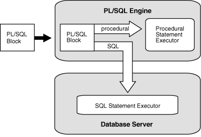
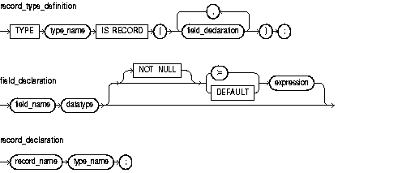
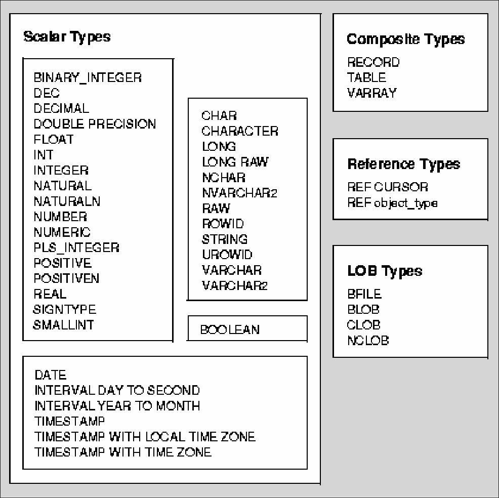
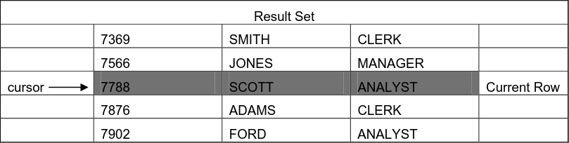

# Allgemein
<ul>
    <li style="display: flex; align-items: center; list-style: none; position: relative;">
        <span style="position: absolute; left: -0.95em;">•</span>
        <p style="margin-top: 0">Entwickelt von </p>
        
    </li>
    <li>Procedural Language extensions to SQL</li>
    <li>Seit Oracle 6.0 (1991)</li>
    <li>Erweiterung mit jeder Oracle Version</li>
</ul>

---

### History

- **Pro*C** (< 1991): Oracle SQL Statements in C
- **PL/SQL 1.0** (1991): Sehr limitiert
- **PL/SQL 2.1**: Prozeduren, Funktionen, Packages
- **PL/SQL 2.2**: Calling Stored Functions in SQL => DBMS_SQL package & DDL statements
- **PL/SQL 2.3**: Binary PL/SQL programs
- **PL/SQL 2.4**: File I/O Support & PL/SQL Table/Record improvements (wie Arrays)
- **Oracle 19c**: Polymorphic Table Functions in the same package -> USING optional

---

# Warum PL/SQL?

- Erweiterung durch 3GL-Elemente (Schleifen, Bedingungen, Prozeduren, Funktionen...)
- Auslagerung von Code/Business-logic in die Datenbank (Datenintegrität 👍, Keine Redundanz 👍)
- Vorbereitung und Speicherung Code (Precompiled im Datenbankcache ⚡)
- Zeit und Aktionsgesteuerte Ausführung (Trigger, Scheduler)
- Komplexe probleme -> einfache sub-programme
- ...

---

# Architektur

- **PL/SQL Engine** -> Komponente von Oracle die PL/SQL Blöcke ausführt
- Engine führt proceduralen Code aus und sendet SQL Statements an den Database Server



---

# Blockstruktur

```sql
<< label >> (optional)
DECLARE    -- Declarative part (optional)
-- Declarations of local types, variables, & subprograms

BEGIN      -- Executable part (required)
-- Statements (which can use items declared in declarative part)

[EXCEPTION -- Exception-handling part (optional)
-- Exception handlers for exceptions (errors) raised in executable part]
END;
```

---

<div style="display: flex; justify-content: center; flex-direction: column; height: 70%">
<h1>Basics & Datenstrukturen</h1>
</div>

---

# Blockstruktur
Anonymer Block (nicht benannt)
```sql
BEGIN
-- Statements
END;
```
---

# Blockstruktur
Lokale Prozedur (nur innerhalb des Blocks)
```sql
DECLARE
    PROCEDURE my_proc IS
    BEGIN
        -- Statements
    END;
BEGIN
    my_proc; -- Nur innerhalb des Blocks aufrufbar
END;
```
---

# Blockstruktur
Stored Procedure (in DB gespeichert)
```sql
CREATE OR REPLACE PROCEDURE my_proc IS
BEGIN
    -- Statements
END;
```
---

# Variablen

```sql
identifier [CONSTANT] datentyp [NOT NULL] [:= | DEFAULT ausdruck]
```
```sql
DECLARE
  emp_count NUMBER(3) := 0;
  part_no NUMBER(4);
  in_stock BOOLEAN;
BEGIN
    select count(*) into emp_count from emp; --Variablen mittels statements zuweisen
END;
```

---

# %Type
Datentyp einer Spalte oder Variable
Verhindert Probleme bei Änderungen
```sql
DECLARE
  v_name emp.e_vname%TYPE
  n_name.emp.e_nname%TYPE
  tmpstr v_name%TYPE
BEGIN
```
[DEMO](./demos/type_demo.sql)

---

# %RowType
Datentyp einer Zeile einer Tabelle (Cursor)
```sql
DECLARE
    dept_row dept%ROWTYPE; 
BEGIN
    SELECT * INTO dept_row FROM dept WHERE deptno = 10;
END;
```

---

# Records

Kann mehrere Variablen verschiedener Datentypen speichern
Deklaration mit %ROWTYPE oder explizit
    


---

# Datentypen

- SQL Types + PL/SQL Types <!-- PL/SQL Datentypen und SQL Datentypen -->
  - z.B BOOLEAN
- Scalar (können subtypes haben)
- Composite
- Large Object (LOB)



<!-- https://docs.oracle.com/html/B28370_05/datatypes.htm -->

---

# Subtype

- Nur subset von von Basis Typ

```sql
SUBTYPE subtype_name IS base_type 
    { precision [, scale ] | RANGE low_value .. high_value } [ NOT NULL ]
```

[DEMO](./demos/subtype_demo.sql)

---

<div style="display: flex; justify-content: center; flex-direction: column; height: 70%">
<h1>Kontrollstrukturen</h1>
</div>

---

# IF-THEN-ELSIF
Klassische verzweigungen
```sql
IF <condition1> THEN
  <sequence_of_statements1>
ELSIF <condition2> THEN
  <sequence_of_statements2>
ELSE
  <sequence_of_statements3>
END IF;
```

---

# CASE
Vergleichbar mit IF-ELSE - wird effizienter ausgeführt. <br>Hierbei wird der selector verwendet anstatt bool'schen Ausdrücken
```sql
CASE selector
  WHEN expression1 THEN
    sequence_of_statements1;
  WHEN expression2 THEN
    sequence_of_statements2;
  ...
  [ELSE
    sequence_of_statementsN;]
END CASE;
```

---

# Searched CASE
Ohne Selector
```sql
CASE
  WHEN grade = 'A' THEN dbms_output.put_line('Excellent');
  WHEN grade = 'B' THEN dbms_output.put_line('Very Good');
  WHEN grade = 'C' THEN dbms_output.put_line('Good');
  WHEN grade = 'D' THEN dbms_output.put_line('Fair');
  WHEN grade = 'F' THEN dbms_output.put_line('Poor');
  ELSE dbms_output.put_line('Invalid grade');
END CASE;
```

---

# Case als Ausdruck
```sql
grade := CASE
  WHEN score >= 90 THEN 'A'
  WHEN score >= 80 THEN 'B'
  WHEN score >= 70 THEN 'C'
  WHEN score >= 60 THEN 'D'
  ELSE 'F'
END;
```

---

# Loop
Endlosschleife<br>
Benötigt **EXIT;** statement zum beenden.
```sql
LOOP
    -- statements
    EXIT WHEN <condition>; -- Gleich wie If-Then EXIT;
END LOOP;
```

---

# Benennung von Schleifen
Schleifen können bennennt werden um mit **EXIT** oder **CONTINUE** gezielt zu springen.
```sql
<<loop1>>
FOR i IN 1..10 LOOP
  <<loop2>>
  FOR j IN 1..10 LOOP
    EXIT loop1 WHEN <condition>;
  END loop;
END loop;
```

---

# While
```sql
WHILE <condition> LOOP
    -- statements
END LOOP;
```

---

# For-Loop
Die zähler variable ist ein Integer, und muss nicht deklariert werden. 
```sql
[<<loop_name>>]
FOR <counter> IN [REVERSE] <lower_bound>..<higher_bound> LOOP 
  <sequence_of_statements> -- Counter kann innerhalb des loops nicht zugewiesen werden.
END LOOP;
```

```sql
FOR i IN 1..10 LOOP
  dbms_output.put_line(i);
END LOOP;
```

---

<div style="display: flex; justify-content: center; flex-direction: column; height: 70%">
<h1>Cursors</h1>
</div>

---

# Cursor

Ein Cursor verwaltet den Zugriff auf einen Datensatz (ergebnis eines Select-Statements)
- 2 Arten:
  - Implitit: DML-Statements die nur eine Zeile returnen
  - Explicit: Queries die mehrere Zeilen returnen
---

# Cursor

- PL/SQL öffnet einen Cursor
- SQL-Statement wird ausgeführt
- PL/SQL schließt den Cursor
- Variable für current row



---

# Cursor
```sql
DECLARE
  CURSOR c1 IS SELECT ename, job FROM emp;
    my_ename emp.ename%TYPE;
    my_job emp.job%TYPE;
BEGIN
  OPEN c1; -- ???
  -- ???
  FETCH c1 INTO my_ename, my_job;
  CLOSE c1; -- ???
END;
```
---

# Cursor
```sql
DECLARE
  CURSOR c1 IS SELECT ename, job FROM emp;
    my_ename emp.ename%TYPE;
    my_job emp.job%TYPE;
BEGIN
  OPEN c1; -- Führt das Select-Statement aus
  -- ???
  FETCH c1 INTO my_ename, my_job; 
  CLOSE c1; -- ???
END;
```
---

# Cursor
```sql
DECLARE
  CURSOR c1 IS SELECT ename, job FROM emp;
    my_ename emp.ename%TYPE;
    my_job emp.job%TYPE;
BEGIN
  OPEN c1; -- Führt das Select-Statement aus
  -- Setzt Cursor auf nächste Zeile & holt current row aus dem Puffer
  FETCH c1 INTO my_ename, my_job; 
  CLOSE c1; -- ???
END;
```
---

# Cursor
```sql
DECLARE
  CURSOR c1 IS SELECT ename, job FROM emp;
    my_ename emp.ename%TYPE;
    my_job emp.job%TYPE;
BEGIN
  OPEN c1; -- Führt das Select-Statement aus
  -- Setzt Cursor auf nächste Zeile & holt current row aus dem Puffer
  FETCH c1 INTO my_ename, my_job;
  CLOSE c1; -- Schließt den Cursor
END;
```
---

# Cursor mit Parameter

```sql
DECLARE
CURSOR c_product (low_price NUMBER, high_price NUMBER)
    IS
        SELECT *
        FROM products
        WHERE price BETWEEN low_price AND high_price;
  BEGIN
    OPEN c_product(100, 200);
    -- Statements
    CLOSE c_product;
END;
```

---

# Wichtige Cursor Attribute
Attribut | return type |                  Amount                   
-----|-------------|:-----------------------------------------:
%FOUND | Booolean    | Wenn letztes Fetch eine Zeile Zurückgiebt |
%NOTFOUND | Boolean     |                 Gegenteil                 |
%ISOPEN | Boolean     |       Ob der Cursor noch offen ist        |
%ROWCOUNT | number      |         Anzahl an gefetchten Rows         |

---

# Cursor-FOR-Loop
Automatisches offnen, fetchen, schließen und loopen
```sql
DECLARE
    CURSOR c1 IS SELECT ename, job FROM emp;
BEGIN
    FOR emp_rec IN c1 LOOP
        dbms_output.put_line(emp_rec.ename || ' ' || emp_rec.job);
    END LOOP;
END;
```
---

# Cursor-Variablen


---

<div style="display: flex; justify-content: center; flex-direction: column; height: 70%">
<h1>Procedures, Functions, Package, Trigger, Jobs...</h1>
</div>

---

### Gruppen

- Aufrufgesteuert 
  * Procedure -> Kein Rückgabewert
  * Function -> Rückgabewert
- Aktionsgesteuert
  * Trigger -> durch DML, DDL oder DB operations "getriggergt"
- Zeitgesteuert
  * Jobs -> Zeitgesteuerte Aufgaben
<!-- - Packages -> Sammlung von Prozeduren, Funktionen, Variablen, Cursor, Exceptions
-->
---

# Procedure
- Kein Rückgabewert
- Mittels **CALL**, **EXECUTE** oder anonymen Block aufrufen (ACHTUNG: Execute funktioniert nur in SQL\*Plus oder SQL Developer)
```sql
CREATE [OR REPLACE] PROCEDURE proc_name [(param_list)] IS
  [lokale Deklarationen]
BEGIN
  ...
[EXCEPTION
  ...]
END;
```

---

# Function
- Rückgabewert
- Kann Parameter haben

---

# Parameter
**Syntax**: \<name> \<modus> \<datentyp>
**Typen**: Grundtypen ohne Größenangaben
**Modi**:
| Mode | Description |
|:------|-------------|
| IN   | übergibt den Wert (call by value)   |
| OUT  | gibt Werte von einer Prozedur zurück (call by reference) |
| IN OUT | übergibt den Wert und kann geändert werden (call by reference) |

---

#### IN/OUT Example

```sql
CREATE OR REPLACE PROCEDURE format_phone
           (p_phone_no IN OUT VARCHAR2 ) IS
BEGIN
          p_phone_no := '('  || SUBSTR (p_phone_no,1,3) ||
                        ') ' || SUBSTR (p_phone_no,4,3) ||
                        '-'  || SUBSTR (p_phone_no,7);
END format_phone;
---------
DECLARE
  v_phone_no VARCHAR2(10) := '+431234567';
BEGIN
  format_phone(v_phone_no);
  DBMS_OUTPUT.PUT_LINE(v_phone_no); -- (+43) 123-4567
END;
```

---


<div style="display: flex; justify-content: center; flex-direction: column; height: 70%">
<h1>Exceptions/Errors</h1>
</div>

---

```sql


BEGIN
    DBMS_OUTPUT.PUT_LINE(' _________  ___  ___  ________  ________   ___  __             ___    ___ ________  ___  ___     ');
    DBMS_OUTPUT.PUT_LINE('|\___   ___\\  \|\  \|\   __  \|\   ___  \|\  \|\  \          |\  \  /  /|\   __  \|\  \|\  \    ');
    DBMS_OUTPUT.PUT_LINE('\|___ \  \_\ \  \\\  \ \  \|\  \ \  \\ \  \ \  \/  /|_        \ \  \/  / | \  \|\  \ \  \\\  \   ');   
    DBMS_OUTPUT.PUT_LINE('     \ \  \ \ \   __  \ \   __  \ \  \\ \  \ \   ___  \        \ \    / / \ \  \\\  \ \  \\\  \  ');   
    DBMS_OUTPUT.PUT_LINE('      \ \  \ \ \  \ \  \ \  \ \  \ \  \\ \  \ \  \\ \  \        \/  /  /   \ \  \\\  \ \  \\\  \ ');   
    DBMS_OUTPUT.PUT_LINE('       \ \__\ \ \__\ \__\ \__\ \__\ \__\\ \__\ \__\\ \__\     __/  / /      \ \_______\ \_______\');   
    DBMS_OUTPUT.PUT_LINE('        \|__|  \|__|\|__|\|__|\|__|\|__| \|__|\|__| \|__|    |\___/ /        \|_______|\|_______|');   
    DBMS_OUTPUT.PUT_LINE('                                                              \|___|/                            ');
    
    DBMS_OUTPUT.PUT_LINE('                 ________  ___               ___ ________  ________  ___                         ');
    DBMS_OUTPUT.PUT_LINE('                 \   __  \|\  \             /  /|\   ____\|\   __  \|\  \                        ');
    DBMS_OUTPUT.PUT_LINE('                  \  \|\  \ \  \           /  //\ \  \___|\ \  \|\  \ \  \                       ');
    DBMS_OUTPUT.PUT_LINE('                 \ \   ____\ \  \         /  //  \ \_____  \ \  \\\  \ \  \                      ');
    DBMS_OUTPUT.PUT_LINE('                  \ \  \___|\ \  \____   /  //    \|____|\  \ \  \\\  \ \  \____                 ');
    DBMS_OUTPUT.PUT_LINE('                   \ \__\    \ \_______\/_ //       ____\_\  \ \_____  \ \_______\               ');
    DBMS_OUTPUT.PUT_LINE('                    \|__|     \|_______|__|/       |\_________\|___| \__\|_______|               ');
    DBMS_OUTPUT.PUT_LINE('                                                   \|_________|     \|__|                        ');
END;


```
---

# Quellen
- https://www.oracle.com/database/technologies/appdev/plsql.html
- https://docs.oracle.com/
- [PL/SQL Basicscriptum - Mag. Johannes Tumfart](PLSQL-Skript.pdf)
- [Einführung PL/SQL - Mag. Johannes Tumfart](EinführungPLSQL.pdf)